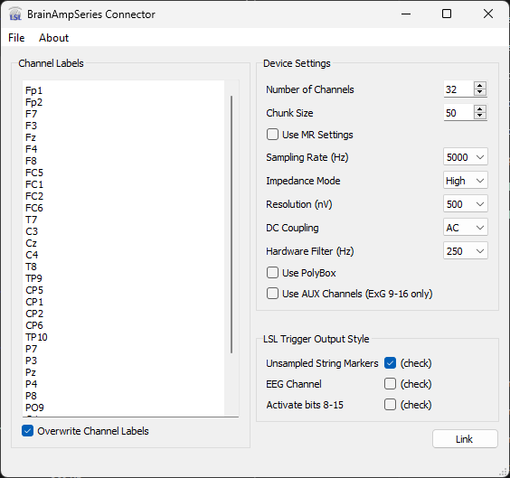

# BrainAmp Series LSL connector
LSL connector for the BrainAmp family of devices from Brain Products.

To download, please click the Release tab above for the latest versions.

Please note that you may need to install the Microsoft C++ redistributable packages ([here]([https://support.microsoft.com/en-us/help/2977003/the-latest-supported-visual-c-downloads](https://learn.microsoft.com/en-US/cpp/windows/latest-supported-vc-redist?view=msvc-170))) in order to run the executables.

# Getting Started
If you are new to using LSL, you might want to read the [Quick Start guide](https://labstreaminglayer.readthedocs.io/info/getting_started.html) on the LabStreamingLayer main repository. 

For measuring impedances, ensuring good signal quality, and troubleshooting basic amplifier functionality, it is always recommended to use [BrainVision Recorder](https://www.brainproducts.com/downloads.php?kid=2) and to consult the amplifier manual.

You can also find a useful (free) LSL viewer on the Brian Products website: [BrainVision LSL Viewer](https://www.brainproducts.com/downloads.php?kid=40&tab=3).

# Usage

Make sure that you have correctly installed the drivers for your amplifier, and that the amplifier is plugged in, turned on, and batteries are charged (see also official manual).
  * Start the BrainAmpSeries Connector app. You should see a window like the following.
> 

## Device Settings

### Device Number

If you have multiple amplifiers plugged in, make sure that you pick the correct one under Device Number (1 is the first one according to USB port numbering). 

### Number of Channels

Select the number of channels that you want to record from and enter the channel labels according to your cap design; make sure that the number of channel labels matches the selected number of channels. See discussion of Channel Labels below for more information.

### Chunk Size

For most EEG experiments you can ignore the Chunk Size setting, but if you are developing a latency-critical real-time application (e.g., a P300 speller BCI), you can lower this setting to reduce the latency of your system. 

### Use MR Settings

For recordings done in the MR scanner (BrainAmpMR and BrainAmpMRplus only), checking this box will automatically choose the recommended settings for use in the scanner.

### Sampling Rate

The sampling rate is in Hz. Note that the native sampling rate for BrainAmp amplifiers is 5kHz. This means that for lower sampling rates, downsampling at the software (as opposed to hardware or driver) level is necessary. To stay consistent with recorder, this app can downsample by a factor of 1, 2, 5, 10, 20, 25. or 50, resulting in a nominal sampling rate of 5000, 2500, 1000, 500, 250, 200, or 100Hz respectively.

To prevent [anti aliasing](https://en.wikipedia.org/wiki/Aliasing) it is necessary to low-pass filter the incoming data prior to downsampling. This is done by way of 2nd order [Butterworth filters](https://en.wikipedia.org/wiki/Butterworth_filter), which are IIR filters that are maximally flat in the passband---thus ensuring minimal signal distortion from the downsampling process. This is also consistent with BrainVision Recorder.

### Impedance Mode

For most applications it is recommended to leave the Impedance Mode and DC coupling options at their defaults (High and AC respectively). Further information is found in the amplifier's manual (and/or the BrainVision recorder manual).

### Resolution

Desired LSB value for digital signals. Note BrainAmp MR devices only support 500 nanovolt resolution.

### DC Coupling

Select AC or DC coupling (BrainAmp DC).

### Hardware Filter

This is an optional lowpass filter executed at the hardware level. For MR recordings it is important to choose 250 Hz.

### Use PolyBox

If you use the PolyBox, check the according box and prepend 8 channel labels at the beginning of the channel list (even if you only use a subset of them). Note that the PolyBox is not the same as the EMG box or other accessories.

### Use PolyBox

If checked, the first 8 channels will hold signals from the PolyBox. Make sure to increase the number of channels and change channel labels accordingly.

### Use AUX Channels (ExG 9-16 only)

When using BrainAmp ExG, if this option is checked, channels 9-16 will be recoreded as AUX channels. Otherwise, all 16 sensors will be bipolar.

## LSL Trigger Output Style

These check boxes determine the way that the app handles device triggers in LSL. 

Note that it is possible to enable neither, one of, or both trigger output styles simultaneously. They are not mutually exclusive.

### Unsampled String Markers

If 'Unsampled String Markers' is checked, the app will create a Marker stream on 'Link' that will forward the triggers received the trigger input in the amplifier hardware. This stream will have the name 'BrainAmpSeries-x-Markers', where 'x' corresponds to the chosen device number.

### EEG Channel

If this box is checked, an extra channel will be added to the EEG stream corresponding to the device triggers in. Rather than unsampled markers, these channels will output -1 if no trigger is available, else the value corresponding to the value at the trigger input when it changes value.

### Activate bits 8-15

Check this if using 16 bit triggering.

### Further Information

Please see the file [explanation_of_trigger_marker_types.pdf]( https://github.com/brain-products/LSL-LiveAmp/blob/master/explanation_of_trigger_marker_types.pdf) for more details.

 ## Link

 When pressed, the Link button will attempt to connect to the device specified in the 'Device Number' field. When complete, the button text will change to 'Unlink' and all other GUI widgets will be disabled. An error message will pop up if no devices are available.

 When the Connector is linked to the BrainAmp device, LSL streams will be created according to the settings set in the GUI. Please note that settings can be saved in a configuration file (see below) for ease of repetition.

## Configuration file

The configuration settings can be saved to a .cfg file (see File / Save Configuration) and subsequently loaded from such a file (via File / Load Configuration). Importantly, the program can be started with a command-line argument of the form "BrainAmpSeries.exe -c myconfig.cfg", which allows to load the config automatically at start-up. The recommended procedure to use the app in production experiments is to make a shortcut on the experimenter's desktop which points to a previously saved configuration customized to the study being recorded to minimize the chance of operator error.

## Channel Labels

If the `Overwrite Channel Labels` box is checked, the channel label field will automatically update when you change the number of channels. The chosen channel label is simply an integer number corresponding to the channel number. You can change the channel labels by editing the `Channel Labels` text field directly.

The latest version of the BrainAmpSeries Connector uses [INI](https://en.wikipedia.org/wiki/INI_file) style configuration files (see above) to store preferred settings between sessions. Easier and less error prone than adjusting channel labels in the App's GUI, is to set the channel labels by editing a config file in a text editor and then loading the updated config file. To do so, in the chosen config file simply create a [section](https://en.wikipedia.org/wiki/INI_file#Sections) called `channels` then create a [key](https://en.wikipedia.org/wiki/INI_file#Keys_(properties)) called `labels` with the corresponding labels for each channel separated by commas. For example, a 32 channel 10-20 layout may look like this:

`[channels]`
`labels=Fp1, Fp2, F7, F3, Fz, F4, F8, FC5, FC1, FC2, FC6, T7, C3, Cz, C4, T8, TP9, CP5, CP1, CP2, CP6, TP10, P7, P3, Pz, P4, P8, PO9, O1, Oz, O2, PO10`

## Loading Channel Label Files

Python users may automatically insert channel labels from a .bvef file into an LSL config file. To do so, please use the free utility [BVEF2lslconfig] (https://github.com/brain-products/BVEF2lslconfig). You can find many electrode position files with channel labels for common cap configurations on the Brain Products website [here](https://www.brainproducts.com/downloads.php?kid=44). 
